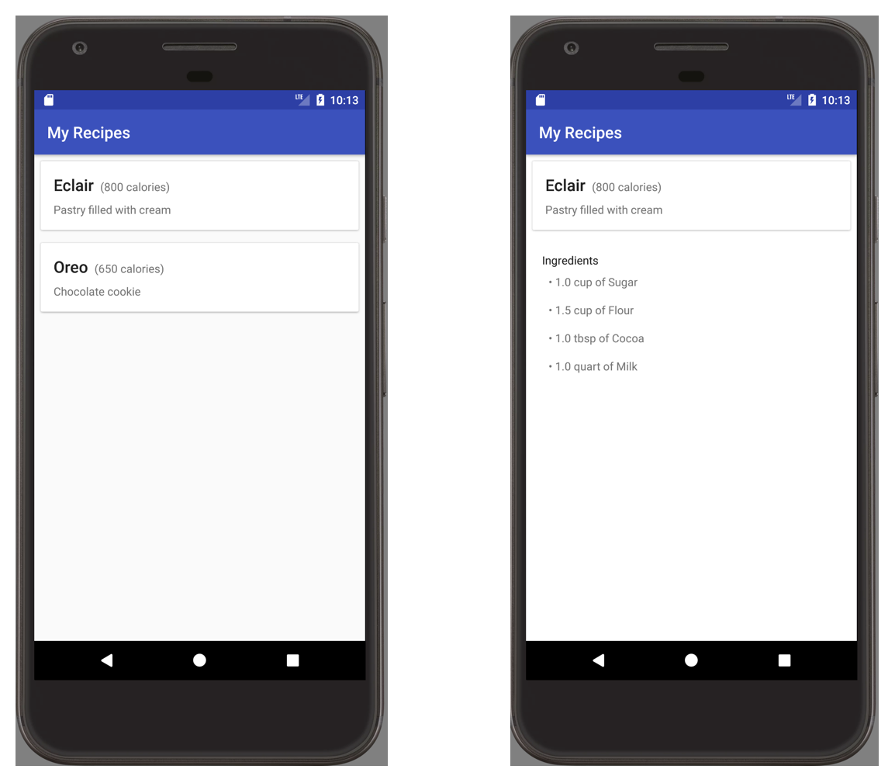

### RealmArchComponentsRecipesApp
Simple Recipes App that uses Realm w/ Android Architecture Components

### Screenshots
.

### Project Layout

Realm Arch Compoenents Recipes App is laid out in a series of modules, each runnable on their own.  Each of these teach a different technique and are runnable on their own.  The modules build on each other in the order defined below.

For example, the DAO lesson module, has the basics of using Realm with DAOs and nothing else.  The next module, live-data-lesson contains everything from the dao-lesson plus it introduces the LiveData concept.

### Modules
* *dao-lesson* - Shows an example of how to use DAOs with Realm.
* *livedata-lesson* - Shows how to expose RealmResults as LiveData.
