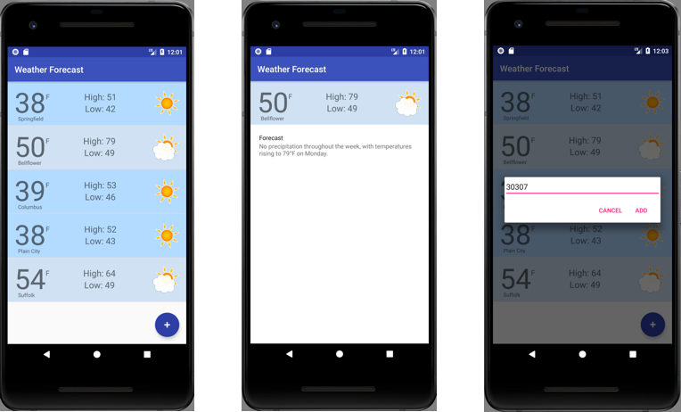

### Weather
This is a demo app built for teaching concepts.  It shows the weather for various cities by zip.

### Usage

1. Add a zip code.
2. It reverse geocodes the lat/long and location name from the zip code.
3. Uses the [darksky.net](https://darksky.net) weather API to fetch current forecast data.
4. Stores all of the data on device, persistent across launches.

### Libraries + Concepts
* *Architectural Patterns* - Model-View-ViewModel, Repository, Dependency Injection.
* *Android GeoCoder API* - For reverse geocoding the zip code.
* *Architecture Compnents* - LiveData, Room, ViewModel.

### Screenshots
.

### Status
This is a work in progress, still adding tests and cleaning up organization.
